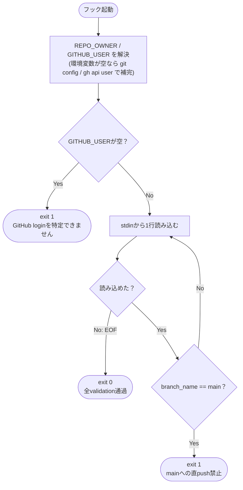

<!-- design-diagram の出力例（1件）。対象の性質に応じてフローチャート以外（シーケンス図・
     データフロー図・ER図）が選ばれることもある。出力の骨格（見出し構成・補足セクション）は
     図の種類によらず共通。 -->

# pre-push フックの制御フロー（Issue #29）

`scripts/hooks/pre-push` は1回の起動につき、環境解決 → 標準入力チェック → stdinの各行（refごと）に
対する検証、という単純な制御フローで構成される。呼び出しをまたいだ永続状態は一切持たないため、
状態遷移図ではなくフローチャートとして表現する。

## フローチャート

## 補足

- **fails-open / fails-closed の非対称性**: `get_pr_info` は `gh` 未インストール時に検証をスキップし
  pushを許可する（fails-open）が、`get_child_branches` は同条件で force-push を拒否する（fails-closed）。
  この非対称性はテストで両方を別々に検証する。
- **ループの中断条件**: 複数refが一度に渡された場合、いずれか1行が `exit 1`/`exit 2` になるとその時点で
  スクリプト全体が終了し、後続行は処理されない。

## exit code早見表

| exit code | 意味 |
| --- | --- |
| 0 | stdinの全refでvalidationを通過 |
| 1 | いずれかのルールでブロック |
| 2 | 標準入力がTTY（フックとして起動されていない） |
