以下の手順で状態遷移分析とテストケース導出を行い、Markdown ドキュメントとして出力してください。

## 入力

対象: $ARGUMENTS

引数が省略された場合は、直前の会話で話題になっている関数またはモジュールを対象とする。

## 1. 対象コードの把握

対象の関数・クラスを読み、以下を把握する。

- 関数のシグネチャと返り値
- **永続化される状態**（DB・ファイル・キャッシュ・インスタンス変数など、呼び出しをまたいで残るもの）
- 状態に対する読み書きのパターン（read-modify-write か、read-only か）

## 2. 状態変数と状態の列挙

「呼び出しをまたいで生き残る変数」が状態変数。状態変数ごとに取りうる値を列挙し、**状態（State）** として名前をつける。

- 状態数は 3〜5 個に収まるよう抽象化する。細かすぎると遷移表が爆発するため。
- 例: `absent`（存在しない）/ `active`（有効）/ `inactive`（無効） のように、意味のある区別だけを状態として立てる。

## 3. イベントの列挙

関数に渡す入力のうち、**状態遷移を引き起こすもの**をイベントとして列挙する。

- 入力値の組み合わせが多い場合は、状態に影響を与えるパラメータだけを軸にしてグループ化する。
- 例: 「CSV に上場で存在」「CSV に非上場で存在」「CSV に存在しない」の 3 パターン。

## 4. 状態遷移図の作成

Mermaid の `stateDiagram-v2` で遷移図を書く。各遷移には「イベント名」と「DiffReport 分類や DB 操作など、遷移で起きること」を添える。

```mermaid
stateDiagram-v2
    [*] --> <初期状態>

    <状態A> --> <状態B> : <イベント><br/>[<遷移で起きること>]
    ...
```



## 5. 遷移表の作成

| 現在の状態 | イベント | 次の状態 | 出力・副作用 |
|-----------|---------|---------|-------------|
| ...       | ...     | ...     | ...         |

遷移が存在しないセル（自己遷移含む）もすべて埋める。空欄は「差分なし」「副作用なし」と明記する。

## 6. 0-switch テストケースの導出

遷移表の**各行を1回カバーする**テストケースを自然言語で列挙する。

各ケースの記述形式:

| # | 初期状態 | イベント | 検証内容 |
|---|---------|---------|---------|
| T1 | `<状態>` | `<イベント>` | `<何が起きることを確認するか>` |

- 初期状態は fixture（外部から注入）で作る。前の呼び出しに依存させない。
- 「何が起きるか」は **出力値** と **状態変化（DB・ファイル等）** の両方を書く。

## 7. 1-switch テストケースの導出

「前の実行が残した状態が次の実行の入力になる」フィードバックループを持つ遷移ペアを特定し、テストケースを列挙する。

選ぶ基準:
- 遷移 X → Y において、X が状態を変化させ、その新しい状態が Y の結果に影響する場合
- 特に「自己遷移」や「フィルタ除外」を含む遷移ペアは見逃しやすいため優先的に含める

各ケースの記述形式:

| # | 遷移列 | 検証内容 | 期待する結果 |
|---|--------|---------|-------------|
| S1 | `<状態A> × <イベント1> → <状態B> × <イベント2>` | `<1回目と2回目それぞれで何を確認するか（対象テスト名・カバレッジ状況を含む）>` | `<本来期待される挙動。実際の挙動が異なる場合は「実際には〜」の形で乖離を明記する>` |

- すべての 1-switch を網羅する必要はない。非自明なもの（直感に反する、バグが潜みやすい）に絞る。
- 「検証内容」には何を・どのテストで確認したかを、「期待する結果」には本来あるべき挙動（バグが見つかった場合は実際の挙動との乖離）を分けて書く。

## 8. 出力

以下の形式で Markdown ファイルを出力する。

出力先: `.claude/reports/task_docs/<関連Issue番号>/state-transition.md`
Issue が不明な場合は `.claude/reports/state-transition-<関数名>.md`

```markdown
# <関数名> 状態遷移図

状態変数: <状態変数の説明>

## 状態定義
...

## イベント定義
...

## 状態遷移図
[mermaid ブロック]

## 遷移表
...

## テストケース一覧

### 0-switch（各遷移を1回カバー）
...

### 1-switch（連続する2遷移のペアをカバー）
前の実行が残した状態が次の実行の入力になる（非冪等）ケース。
...
```

## 完了報告

- 生成したファイルのパス
- 状態数・イベント数・0-switch ケース数・1-switch ケース数
- 特に注意が必要と判断した遷移（バグが潜みやすい箇所）の概要
