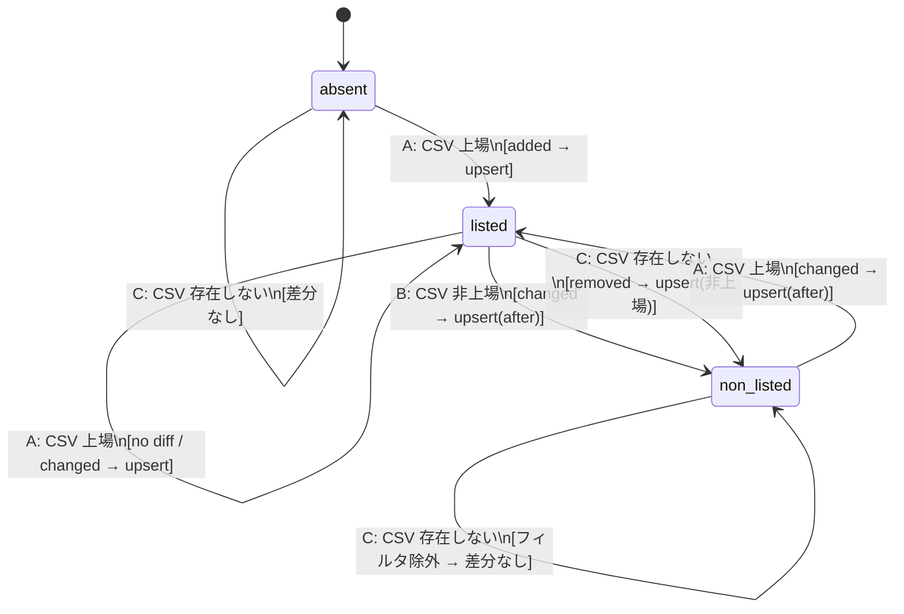

<!-- design-state-tests スキルの出力例。
     架空の対象関数（apply_and_report）を用いた分析結果。 -->

## 入力

`apply_and_report` — CSV を読み込み、DB に差分を反映してレポートを返す関数（`scripts/data_sync/code_list_parser.py`）

---

## 分析結果

### 状態変数

ある `entity_code` の DB 上の `listing_status`

### 状態定義

| 状態 | 意味 |
|------|------|
| `absent` | DB にレコードなし |
| `listed` | DB に `listing_status = "上場"` |
| `non_listed` | DB に `listing_status = "非上場"` |

### イベント定義（CSV の内容）

| イベント | 意味 |
|---------|------|
| **A** | その entity_code が `listing_status = "上場"` で存在する |
| **B** | その entity_code が `listing_status = "非上場"` で存在する |
| **C** | その entity_code が存在しない |

### 状態遷移図

### 遷移表

| 現在の状態 | イベント | 次の状態 | DiffReport 分類 | DB 操作 |
|-----------|---------|---------|----------------|--------|
| `absent` | A | `listed` | `added` | upsert（挿入） |
| `absent` | B | `absent` | `added` | スキップ（listing_status != 上場） |
| `absent` | C | `absent` | — | なし |
| `listed` | A | `listed` | `changed` or — | upsert（after）or なし |
| `listed` | B | `non_listed` | `changed` | upsert（after: listing_status=非上場） |
| `listed` | C | `non_listed` | `removed` | upsert（listing_status=非上場 で書き戻し） |
| `non_listed` | A | `listed` | `changed` | upsert（after: listing_status=上場） |
| `non_listed` | B | `non_listed` | `changed` or — | upsert（after）or なし |
| `non_listed` | C | `non_listed` | — | なし（フィルタ除外） |

### テストケース一覧

#### 0-switch（各遷移を1回カバー）

| # | 初期状態 | イベント | 検証内容 |
|---|---------|---------|---------|
| T1 | `absent` | A（CSV: 上場） | `added` が 1 件、DB にレコードが挿入され `listing_status = "上場"` になること |
| T2 | `absent` | B（CSV: 非上場） | `added` が 1 件、DB にレコードが挿入**されない**こと |
| T3 | `absent` | C（CSV: 存在しない） | 差分なし（added / removed / changed がすべて空）、DB に変化がないこと |
| T4 | `listed` | A（CSV: 上場・値変化なし） | 差分なし、DB に変化がないこと |
| T5 | `listed` | A（CSV: 上場・会社名変化あり） | `changed` が 1 件、DB の会社名が更新されること |
| T6 | `listed` | B（CSV: 非上場） | `changed` が 1 件、DB の `listing_status` が `"非上場"` に更新されること |
| T7 | `listed` | C（CSV: 存在しない） | `removed` が 1 件、DB の `listing_status` が `"非上場"` に更新されること |
| T8 | `non_listed` | A（CSV: 上場） | `changed` が 1 件、DB の `listing_status` が `"上場"` に更新されること |
| T9 | `non_listed` | B（CSV: 非上場・値変化なし） | 差分なし、DB に変化がないこと |
| T10 | `non_listed` | C（CSV: 存在しない） | 差分なし（`removed` が空）、DB に変化がないこと |

#### 1-switch（連続する2遷移のペアをカバー）

前の実行が残した状態が次の実行の入力になる（非冪等）ケース。

| # | 遷移列 | 検証内容 |
|---|--------|---------|
| S1 | `listed × C → non_listed × C` | 1回目で `removed` 検出 + DB 非上場更新、2回目は `removed` が空になること |
| S2 | `listed × B → non_listed × C` | 上場廃止（changed）後に CSV から消滅しても、2回目は `removed` が空になること |
| S3 | `listed × C → non_listed × A` | CSV 消滅後に翌回 CSV 上場で再登場 → `changed` として検出され `listing_status` が `"上場"` に戻ること |
| S4 | `absent × A → listed × C` | 初回挿入後に CSV から消滅 → `removed` 検出 + DB 非上場更新、`find_by_sec_code` で引き続き引けること |
| S5 | `absent × B → absent × A` | 非上場で added スキップ後、翌回上場で CSV に登場 → `added` として検出され DB に挿入されること |

---

## 完了報告

- 生成ファイル: `.claude/reports/task_docs/xxx/state-transition.md`
- 状態数: 3 / イベント数: 3 / 0-switch: 10 ケース / 1-switch: 5 ケース
- 注意が必要な遷移:
  - `listed × C → non_listed`（removed 後の DB 書き戻し）: フィルタとセットでないと2回目以降に再検出が続く
  - `non_listed × C → non_listed`（フィルタ除外による自己遷移）: 実装に明示的なフィルタがないと「差分なし」にならずバグになる
